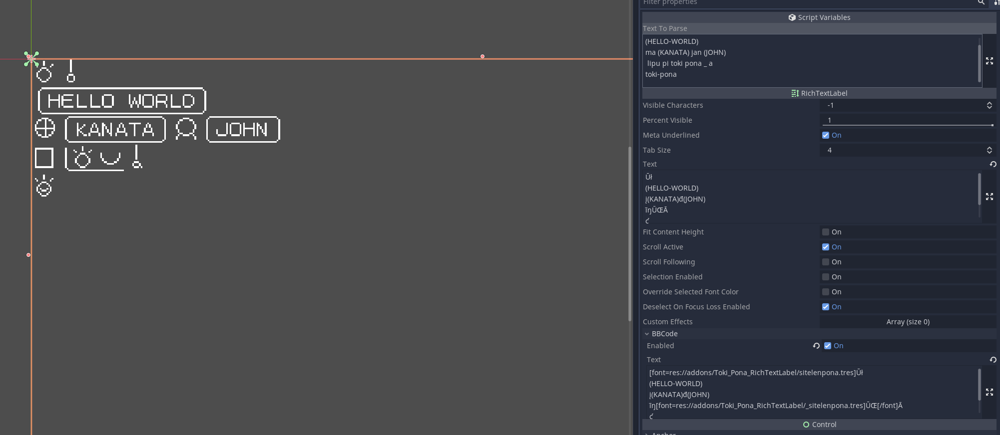

# Toki Pona RichTextLabel for Godot

## Description: 
A custom RichTextLabel Node which translates toki pona words written in regular text (standard latin characters) into sitelen pona glyphs. The glyphs in the font used are mapped to characters which do not appear in toki pona text, so the translation turns each word into one of those characters, which then appears as the sitelen pona glyph from the font.

## Usage:
* Add a new TokiPonaRichTextLabelType node to your scene! 
* Type lowercase latin/romanized toki poki to the "Text to Parse" field in the inspector, rather than the regular "Text" field. (Example: `toki o`)
* Magic! Your text is now appearing in a sitelen pona pixel font!
* Other features:
  * use brackets encapsulating ``(ALL-CAPS-TEXT)`` to create a cartouche (box) around words that should appear in romanized/latin characters, like proper names. Use a dash for spaces(Examples: `ma (KANATA)`, `jan (JOHN)`)
  * use ``pi`` and ``_`` to start and stop the underline-style pi (Example: ``lipu pi toki pona _ `` (the space is important, pretend '_' is like an invisible extra word/particle)
  * there are a handful of combined glyphs included, which are detected with a dash. (Example: ``toki-pona``). The ones I added were particular to te project I was working on, but you could always add your own by checking the dictionary in toki_pona_richtextlabel.gd and modifying the bitmap font! (see link to bitmap font creator readme below)
  

  
## Attribution
The bitmap fonts in this add-on were made with [Bitmap Font Creator by JohnDevlopment] (https://github.com/JohnDevlopment/bitmap-font-creator). 

For the romanized/latin font, I tried to emulate the font used in Tamagotchis.
